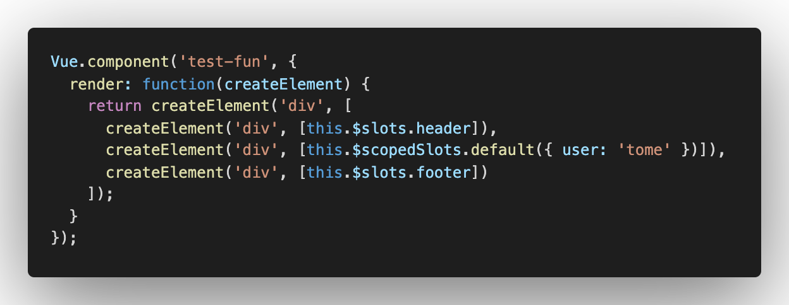
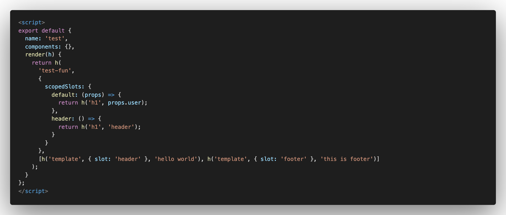

## [VUE 起步](https://cn.vuejs.org/v2/guide/installation.html)

| 指令名称 |          说明          | 简写 |
| :------: | :--------------------: | :--: |
|  v-bind  | 标注属性`id` `class`等 |  :   |
|   v-on   |  监听事件`onclick`等   |  @   |
| v-model  |     绑定值`value`      |      |
|  v-slot  |          插槽          |  #   |

## 注册组件

> 组件命名规则

> > 1: `kebab-case` (短横线分隔命名) 必须在引用这个自定义元素时使用
> > 2: `PascalCase` (首字母大写命名) 引用是可以使用（`kebab-case`）和（`PascalCase`）

```js
import Vue from "vue";

// 单个组件方式一
import xx from "file";
Vue.component("组件名", xx);

// 多组件 install
import xx1 from "file";
// 导入多个组件

export default {
  install(Vue) {
    // 对应多个
    Vue.component("组件名1", xx1);
  },
};
```

### [插槽](https://cn.vuejs.org/v2/guide/components-slots.html)（`slot`）

> > 只能`组件`或 `template` 能够使用`v-slot`

> 普通插槽(默认)

```vue
// 父组件
<template>
  <component-name>普通插槽</component-name>
</template>

//子组件
<template>
  <slot></slot>
</template>

// 渲染结果
<div>
  普通插槽
</div>
```

> 具名插槽

```vue
// 父组件
<template>
  <component-name>默认插槽</component-name>
  <component-name v-slot:data1>具名插槽</component-name>
</template>

//子组件
<template>
  <slot></slot>
  <slot name="data1"></slot>
</template>

<div>
  普通插槽
  具名插槽
</div>
```

> 作用域插槽
>
> > 子组件提供数据父组件渲染

```vue
// 父组件
<template>
  // 写法一
  <component-name v-slot:data1="data">{{ data }}</component-name>
  // 写法二
  <component-name #data1="data">{{ data }}</component-name>
</template>

// 子组件
<template>
  <slot name="data1" v-bind:info="123"></slot>
</template>

// 渲染结果
<div>
  123
</div>
```

### 渲染函数

> 注册组件
>
> > 

> > 
